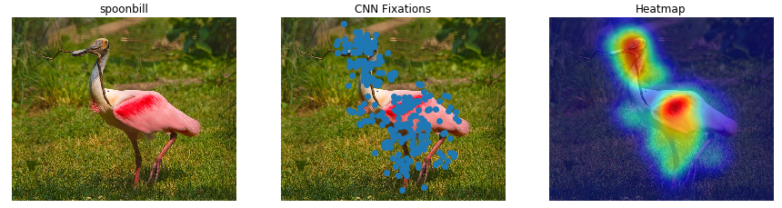
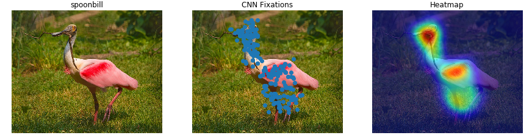
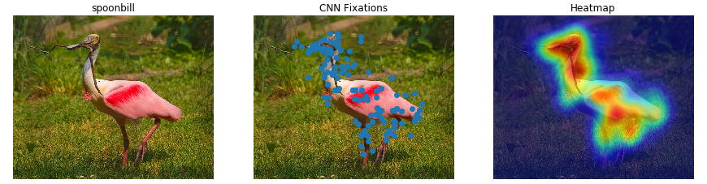
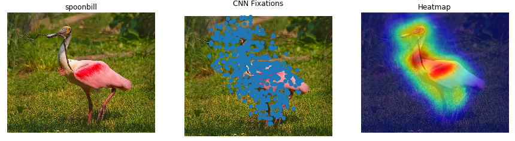

# CNN-Fixations
Code for the paper CNN fixations: An unraveling approach to identify discriminative image regions

### Usage Instructions

1. In the demo folder add path to caffe installation

2. Install the required dependencies

3. Navigate to the Demo folder and open a ipython notebook

*Add the .caffemodels for the respective architechtures before running the codes*

### Samples

Results of running the demo for one image from ILSVRC validation set

#### AlexNet

#### VGG 16

#### GoogLeNet

#### ResNet 101

Contact [Utsav Garg](http://utsavgarg.github.io/) if you have questions.
